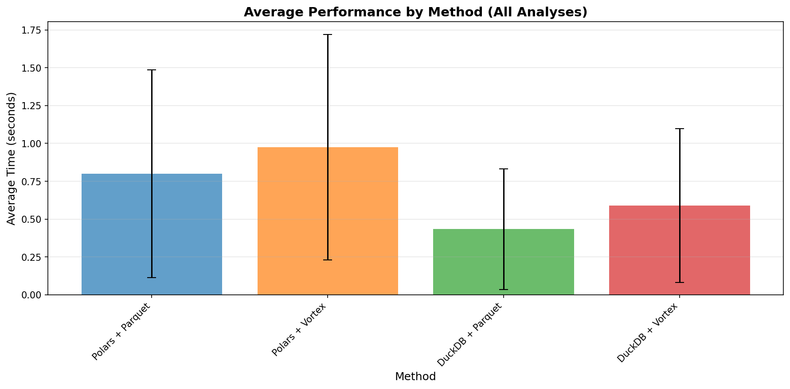
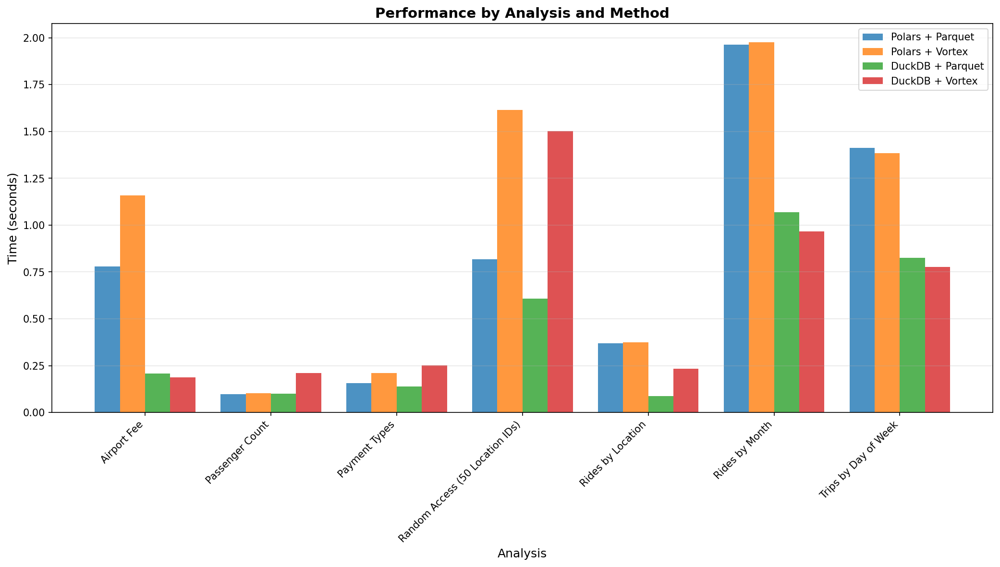
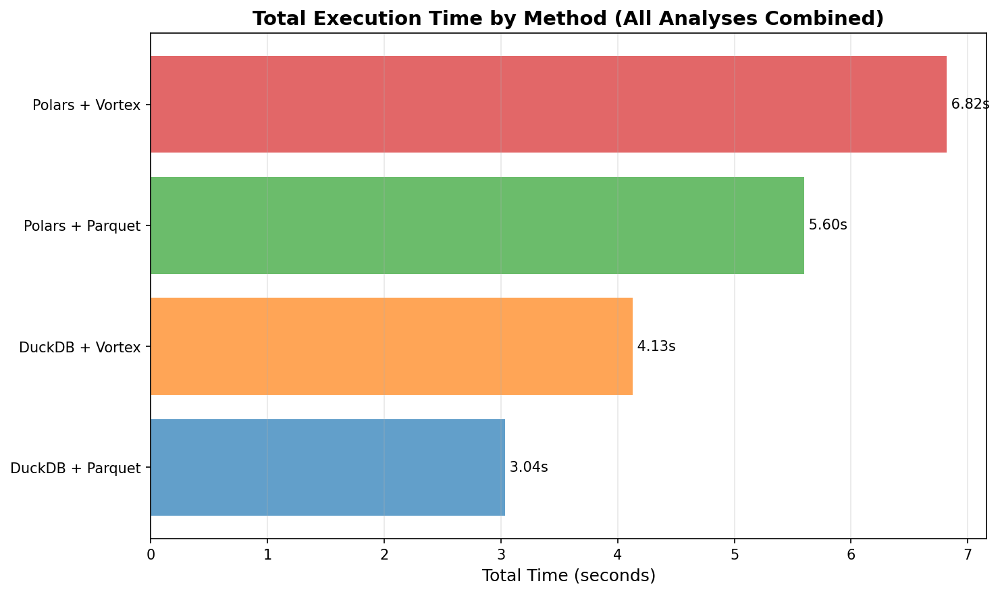
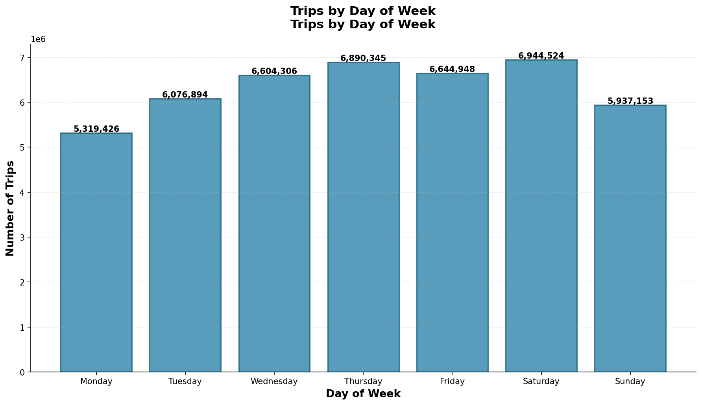
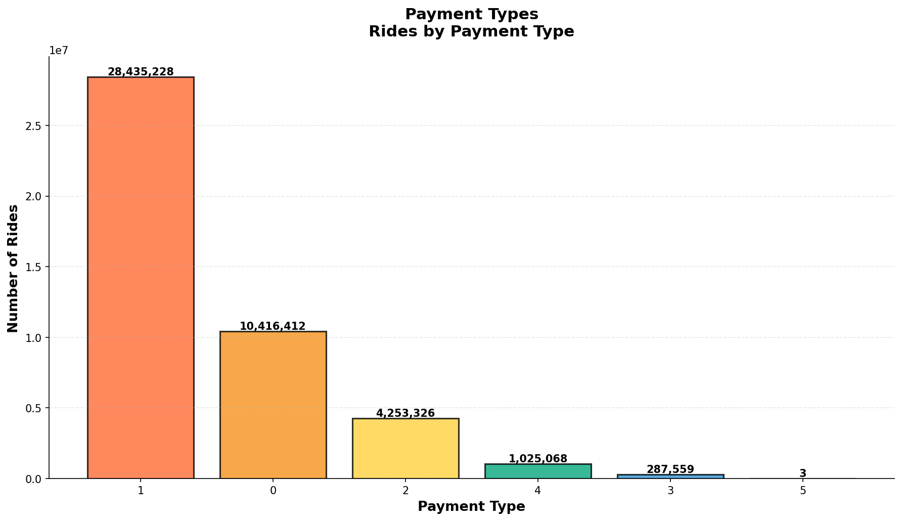
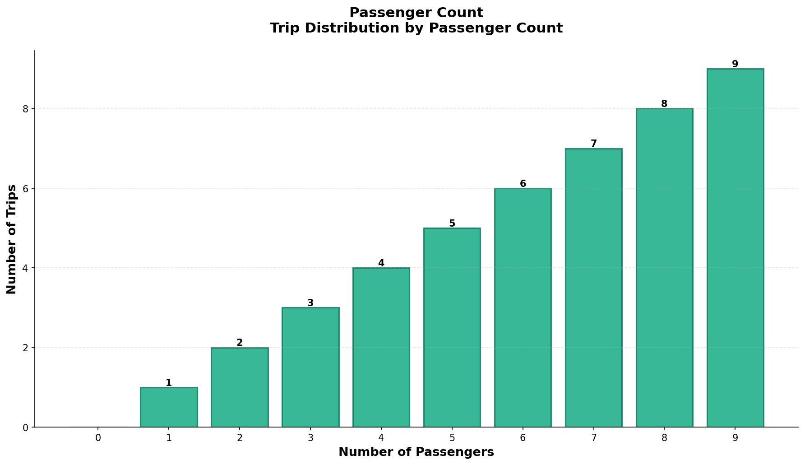
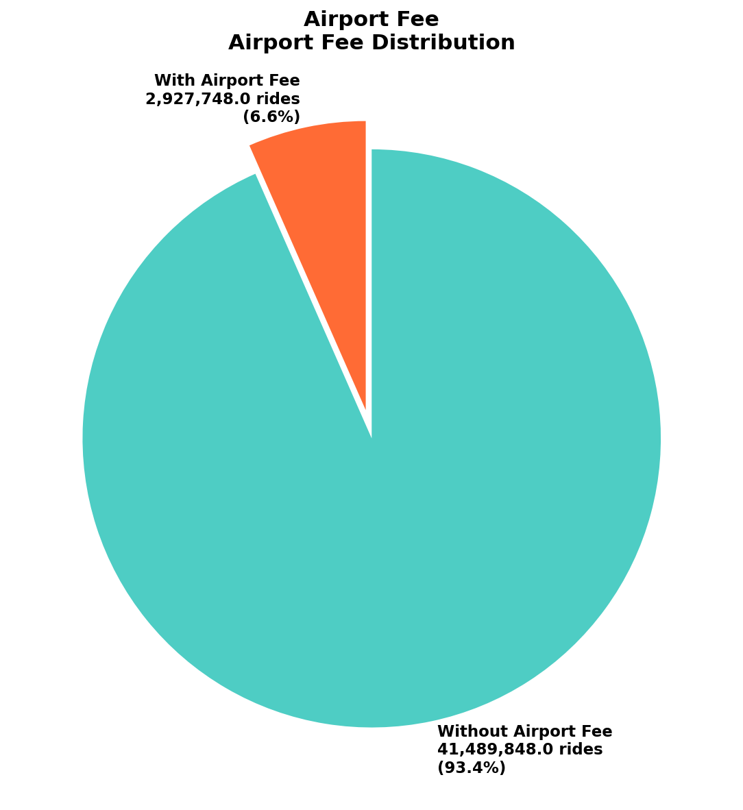

# NYC Taxi Data Benchmark Results (Single-File Mode)

This benchmark compares the performance of different query engines and data formats
for analyzing NYC taxi data based on the [Row Zero example analyses](https://rowzero.com/datasets/nyc-taxi-data).

## ⚠️ Important: Understanding These Results

**This benchmark tests single-file aggregation workloads (full table scans).**

This mode uses merged files, which better reflects Vortex's claimed performance advantages.
Vortex claims 10-20x faster scans for single-file operations.

## Benchmark Configuration

- **Data Files**: 1 merged parquet file, 1 merged vortex file
- **File Names**: yellow_tripdata_2025_merged.parquet, yellow_tripdata_2025_merged.vortex
- **Runs per benchmark**: 5
- **Taxi Type**: yellow
- **Year**: 2025
- **Mode**: Single-File
- **Workload Type**: Single-file sequential scans with aggregations

## Results Summary

| Analysis | Polars + Parquet | Polars + Vortex | DuckDB + Parquet | DuckDB + Vortex |
|----------|------------------|-----------------|------------------|-----------------|
| Airport Fee | 0.780s (±0.127s) | 1.158s (±0.179s) | 0.209s (±0.169s) | 0.188s (±0.014s) |
| Passenger Count | 0.097s (±0.007s) | 0.103s (±0.005s) | 0.100s (±0.012s) | 0.211s (±0.002s) |
| Payment Types | 0.157s (±0.012s) | 0.211s (±0.010s) | 0.139s (±0.012s) | 0.251s (±0.005s) |
| Random Access (50 Location IDs) | 0.818s (±0.035s) | 1.614s (±0.158s) | 0.607s (±0.157s) | 1.502s (±0.343s) |
| Rides by Location | 0.369s (±0.038s) | 0.374s (±0.023s) | 0.087s (±0.018s) | 0.234s (±0.010s) |
| Rides by Month | 1.964s (±0.065s) | 1.976s (±0.029s) | 1.069s (±0.021s) | 0.967s (±0.003s) |
| Trips by Day of Week | 1.412s (±0.051s) | 1.384s (±0.030s) | 0.826s (±0.012s) | 0.776s (±0.007s) |

## Fastest Method by Analysis

| Analysis | Fastest Method | Time |
|----------|----------------|------|
| Airport Fee | DuckDB + Vortex | 0.188s |
| Passenger Count | Polars + Parquet | 0.097s |
| Payment Types | DuckDB + Parquet | 0.139s |
| Random Access (50 Location IDs) | DuckDB + Parquet | 0.607s |
| Rides by Location | DuckDB + Parquet | 0.087s |
| Rides by Month | DuckDB + Vortex | 0.967s |
| Trips by Day of Week | DuckDB + Vortex | 0.776s |

## Overall Performance Summary

| Method | Average Time | Total Time (All Analyses) |
|--------|--------------|---------------------------|
| DuckDB + Parquet | 0.434s | 3.036s |
| DuckDB + Vortex | 0.590s | 4.129s |
| Polars + Parquet | 0.800s | 5.597s |
| Polars + Vortex | 0.974s | 6.821s |

## Query Results

Below are the actual results from each analysis query:

### Airport Fee

| total_rides | rides_with_airport_fee | percentage_with_airport_fee |
| --- | --- | --- |
| 44,417,596 | 2,927,748 | 6.59 |


### Passenger Count

| passenger_count | trip_count |
| --- | --- |
### Passenger Count

```
    passenger_count  trip_count
0               NaN    10416412
1               0.0      241235
2               1.0    26970031
3               2.0     4698059
4               3.0     1094572
5               4.0      739893
6               5.0      162666
7               6.0       94589
8               7.0          23
9               8.0          83
10              9.0          33
```

### Payment Types

| payment_type | count | total_revenue |
| --- | --- | --- |
| 0 | 10,416,412 | 219,129,364.70 |
| 1 | 28,435,228 | 857,227,389.37 |
| 2 | 4,253,326 | 97,353,492.34 |
| 3 | 287,559 | 2,153,866.42 |
| 4 | 1,025,068 | 2,278,248.58 |
| 5 | 3 | 71.99 |


### Random Access (50 Location IDs)

| count |
| --- |
| 8416172 |


### Rides by Location

| PULocationID | trip_count |
| --- | --- |
| 237 | 1929746 |
| 161 | 1927345 |
| 132 | 1897967 |
| 236 | 1697494 |
| 186 | 1407984 |
| 230 | 1394376 |
| 162 | 1377299 |
| 142 | 1253795 |
| 170 | 1187380 |
| 234 | 1180906 |
| 138 | 1179584 |
| 68 | 1143967 |
| 163 | 1130378 |
| 79 | 1117523 |
| 239 | 1106552 |
| 48 | 1052565 |
| 249 | 975342 |
| 164 | 946566 |
| 141 | 933624 |
| 107 | 837894 |


### Rides by Month

| month | total_rides | total_congestion_fee | rides_with_congestion_fee |
| --- | --- | --- | --- |
| 2007-12 | 1 | 0.75 | 1 |
| 2008-12 | 1 | 0 | 0 |
| 2009-01 | 6 | 3 | 4 |
| 2024-12 | 21 | 0 | 0 |
| 2025-01 | 3,475,234 | 1,679,977.50 | 2,246,523 |
| 2025-02 | 3,577,542 | 1,922,275.75 | 2,600,265 |
| 2025-03 | 4,145,229 | 2,223,608.25 | 3,011,889 |
| 2025-04 | 3,970,568 | 2,113,801.50 | 2,869,048 |
| 2025-05 | 4,591,844 | 2,423,911.25 | 3,284,506 |
| 2025-06 | 4,322,949 | 2,305,133.75 | 3,123,440 |
| 2025-07 | 3,898,971 | 2,088,469 | 2,835,653 |
| 2025-08 | 3,574,080 | 1,889,518.50 | 2,570,863 |
| 2025-09 | 4,251,019 | 2,271,439 | 3,080,640 |
| 2025-10 | 4,428,708 | 2,371,890.75 | 3,208,188 |
| 2025-11 | 4,181,423 | 2,237,072.25 | 3,014,907 |


### Trips by Day of Week

| day_of_week | trip_count | day_order |
| --- | --- | --- |
| Friday | 6,644,948 | 4 |
| Monday | 5,319,426 | 0 |
| Saturday | 6,944,524 | 5 |
| Sunday | 5,937,153 | 6 |
| Thursday | 6,890,345 | 3 |
| Tuesday | 6,076,894 | 1 |
| Wednesday | 6,604,306 | 2 |


## Performance Visualizations

### Average Performance by Method



### Performance by Analysis and Method



### Total Execution Time by Method




## Analysis Results Visualizations

### Trips By Day Of Week



### Payment Types



### Passenger Count



### Rides By Month


### Airport Fee



### Rides By Location


### Random Access (50 Location Ids)

_single.png)

